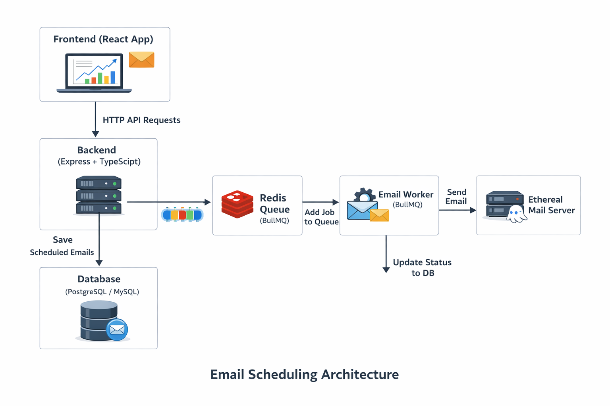

📧 ReachInbox – Email Scheduler (Hiring Assignment)

This project is a full-stack email scheduling system built as part of the ReachInbox hiring assignment.
It allows users to schedule emails, view scheduled emails, view sent emails, and simulates real-world behavior like queueing, rate limits, and persistence.

✨ Features
Backend

Schedule emails using API

Stores emails in database (PostgreSQL/MySQL via TypeORM)

Uses BullMQ + Redis for job queue

Worker sends emails using Ethereal SMTP (fake email testing service)

Emails survive server restarts (jobs are not lost)

Rate limiting (max emails per hour)

Concurrency control (number of emails sent at once)

Frontend

Dashboard UI (React + TypeScript)

Compose new email (subject, body, upload CSV, scheduling options)

Upload CSV and detect number of emails

View Scheduled Emails

View Sent Emails

Basic loading states and error handling

🛠 Tech Stack

Backend

Node.js + Express + TypeScript

BullMQ + Redis (queue system)

PostgreSQL/MySQL (database using TypeORM)

Nodemailer + Ethereal (email sending)

Frontend

React + TypeScript

Basic CSS (can be improved further)

⚙️ How to Run the Project
1. Clone the repository
git clone https://github.com/srinidhi84/reachinbox_assignment.git
cd reachinbox_assignment

▶️ Backend Setup

Go to backend folder:

cd backend
npm install

Create a .env file inside /backend:

PORT=4000

DB_HOST=localhost
DB_PORT=5432
DB_USERNAME=postgres
DB_PASSWORD=yourpassword
DB_NAME=reachinbox

REDIS_HOST=127.0.0.1
REDIS_PORT=6379

MAX_EMAILS_PER_HOUR=5
WORKER_CONCURRENCY=1

Make sure:

PostgreSQL or MySQL is running

Redis is running

Then run backend:

npm run dev

Run worker (in another terminal):

npx ts-node-dev src/workers/emailWorker.ts

▶️ Frontend Setup

Go to frontend folder:

cd frontend
npm install
npm run dev

Open in browser:

http://localhost:5173

📧 Ethereal Email Setup

This project uses Ethereal Email (fake SMTP for testing).

No signup is required.
Each time an email is sent, Nodemailer prints a Preview URL in the console like:

Preview URL: https://ethereal.email/message/xxxxx

You can open this link in browser to see the email content.

🧠 Architecture Overview
How Scheduling Works

User submits email from frontend

Backend saves it to database

A job is added to BullMQ queue (Redis)

Worker listens to queue and sends email via Ethereal

Persistence on Restart

Jobs are stored in Redis

Emails are stored in DB

If backend or worker restarts:

Already scheduled emails are not lost

Jobs continue from where they left off

Rate Limiting & Concurrency

Configurable via .env:

MAX_EMAILS_PER_HOUR

WORKER_CONCURRENCY

BullMQ worker is configured with:

Concurrency control (how many emails at once)

Limiter (how many per hour)

This simulates real-world email throttling behavior

📋 Implemented Features (Mapped to Assignment)
Backend

✅ API to schedule emails
✅ Stores scheduled emails in DB
✅ Queue-based scheduling (BullMQ + Redis)
✅ Worker-based processing
✅ Persistence after restart
✅ Rate limiting using BullMQ limiter
✅ Concurrency control in worker
✅ Ethereal SMTP integration

Frontend

✅ Dashboard UI
✅ Compose Email modal
✅ Upload CSV file
✅ Detect number of emails
✅ Scheduled emails table
✅ Sent emails table
✅ Basic validation
✅ Loading and error handling

ARCHITECTURE OVERVIEW:

